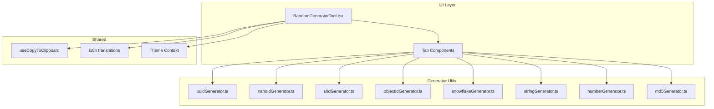

# 设计文档

## 概述

本设计文档描述了将现有 UUID 生成器工具扩展为综合性随机生成器工具的技术方案。新工具将支持多种 ID 格式（UUID、NanoID、ULID、ObjectId、雪花 ID）、随机字符串、随机数字和 MD5 哈希计算。

工具将采用标签页式 UI 设计，每种生成类型作为独立标签页，保持界面简洁的同时提供丰富功能。

## 架构



## 组件和接口

### 主组件

```typescript
// src/pages/newtab/components/tools/RandomGeneratorTool.tsx
interface RandomGeneratorToolProps extends ToolComponentProps {
  isExpanded: boolean;
  onToggleExpand: () => void;
}

type GeneratorType = 
  | 'uuid' 
  | 'nanoid' 
  | 'ulid' 
  | 'objectid' 
  | 'snowflake' 
  | 'string' 
  | 'number' 
  | 'md5';
```

### 生成器接口

```typescript
// src/utils/randomGenerators.ts

// UUID 生成器
interface UUIDOptions {
  version: 'v1' | 'v4';
  withHyphens: boolean;
}
function generateUUID(options: UUIDOptions): string;

// NanoID 生成器
interface NanoIDOptions {
  length: number; // 1-64, default 21
}
function generateNanoID(options: NanoIDOptions): string;

// ULID 生成器
function generateULID(): string;
function parseULIDTimestamp(ulid: string): Date;

// ObjectId 生成器
function generateObjectId(): string;
function parseObjectIdTimestamp(objectId: string): Date;

// 雪花 ID 生成器
interface SnowflakeConfig {
  epoch?: number; // 自定义纪元，默认 Twitter 纪元
  workerId?: number; // 工作节点 ID，默认 1
  datacenterId?: number; // 数据中心 ID，默认 1
}
function generateSnowflakeId(config?: SnowflakeConfig): string;
function parseSnowflakeTimestamp(id: string, epoch?: number): Date;

// 随机字符串生成器
interface StringOptions {
  length: number; // 1-256
  uppercase: boolean;
  lowercase: boolean;
  numbers: boolean;
  symbols: boolean;
}
function generateRandomString(options: StringOptions): string;

// 随机数字生成器
interface NumberOptions {
  min: number;
  max: number;
}
function generateRandomNumber(options: NumberOptions): number;

// MD5 哈希
interface MD5Options {
  uppercase: boolean;
}
function calculateMD5(text: string, options: MD5Options): string;
```

### 批量生成接口

```typescript
// 通用批量生成函数
function generateBatch<T>(
  generator: () => T,
  count: number
): T[];
```

## 数据模型

### 生成结果状态

```typescript
interface GeneratorState {
  activeTab: GeneratorType;
  results: string[];
  count: number;
  
  // UUID 选项
  uuidVersion: 'v1' | 'v4';
  uuidWithHyphens: boolean;
  
  // NanoID 选项
  nanoidLength: number;
  
  // 随机字符串选项
  stringLength: number;
  stringUppercase: boolean;
  stringLowercase: boolean;
  stringNumbers: boolean;
  stringSymbols: boolean;
  
  // 随机数字选项
  numberMin: number;
  numberMax: number;
  
  // MD5 选项
  md5Input: string;
  md5Uppercase: boolean;
}
```

## 正确性属性

*属性是系统在所有有效执行中应保持为真的特征或行为——本质上是关于系统应该做什么的形式化陈述。属性作为人类可读规范和机器可验证正确性保证之间的桥梁。*

### Property 1: UUID 格式有效性
*对于任意* UUID 生成请求，生成的 UUID v4 字符串应符合 RFC 4122 格式：8-4-4-4-12 的十六进制字符，且版本位为 4，变体位正确
**Validates: Requirements 1.1, 1.2**

### Property 2: UUID 无连字符格式
*对于任意* 选择无连字符选项的 UUID 生成请求，生成的字符串长度应为 32，且不包含任何连字符
**Validates: Requirements 1.3**

### Property 3: 批量生成数量一致性
*对于任意* 指定数量 n（1-100）的生成请求，返回的结果数组长度应等于 n
**Validates: Requirements 1.4, 3.3, 5.2, 5.1.3, 5.2.2, 5.3.2**

### Property 4: 随机字符串字符集约束
*对于任意* 随机字符串生成请求，生成的字符串应仅包含所选字符集中的字符
**Validates: Requirements 2.1, 2.2, 2.3, 2.4**

### Property 5: 随机字符串长度约束
*对于任意* 指定长度 L（1-256）的随机字符串生成请求，生成的字符串长度应等于 L
**Validates: Requirements 2.5**

### Property 6: 随机数字范围约束
*对于任意* 指定范围 [min, max] 的随机数字生成请求，生成的数字 n 应满足 min ≤ n ≤ max
**Validates: Requirements 3.1**

### Property 7: MD5 哈希确定性
*对于任意* 相同的输入文本，MD5 计算应始终返回相同的 32 位十六进制哈希值
**Validates: Requirements 4.1**

### Property 8: MD5 大小写输出
*对于任意* MD5 计算结果，选择大写选项时输出应全为大写字母，选择小写选项时应全为小写字母
**Validates: Requirements 4.2, 4.3**

### Property 9: 雪花 ID 递增性
*对于任意* 连续生成的雪花 ID 序列，后生成的 ID 数值应大于先生成的 ID
**Validates: Requirements 5.1, 5.3**

### Property 10: NanoID 格式有效性
*对于任意* NanoID 生成请求，生成的字符串应仅包含 URL 安全字符（A-Za-z0-9_-）
**Validates: Requirements 5.1.1, 5.1.4**

### Property 11: NanoID 长度约束
*对于任意* 指定长度 L（1-64）的 NanoID 生成请求，生成的字符串长度应等于 L
**Validates: Requirements 5.1.2**

### Property 12: ULID 格式有效性
*对于任意* ULID 生成请求，生成的字符串长度应为 26，且仅包含 Crockford Base32 字符
**Validates: Requirements 5.2.1**

### Property 13: ULID 递增性
*对于任意* 在同一毫秒内连续生成的 ULID 序列，后生成的 ULID 按字典序应大于先生成的 ULID
**Validates: Requirements 5.2.3**

### Property 14: ObjectId 格式有效性
*对于任意* ObjectId 生成请求，生成的字符串长度应为 24，且仅包含十六进制字符
**Validates: Requirements 5.3.1**

### Property 15: ObjectId 时间戳可提取性
*对于任意* 生成的 ObjectId，从前 8 个字符提取的时间戳应在生成时间的合理范围内（±1秒）
**Validates: Requirements 5.3.4**

## 错误处理

| 错误场景 | 处理方式 |
|---------|---------|
| 未选择任何字符集 | 显示错误提示，禁用生成按钮 |
| 最小值大于最大值 | 显示错误提示，禁用生成按钮 |
| 输入非整数值 | 显示错误提示，禁用生成按钮 |
| 生成数量超出范围 | 自动限制在 1-100 范围内 |
| 字符串长度超出范围 | 自动限制在 1-256 范围内 |
| NanoID 长度超出范围 | 自动限制在 1-64 范围内 |

## 测试策略

### 单元测试

使用 Vitest 进行单元测试，覆盖以下场景：

1. 各生成器的基本功能测试
2. 边界条件测试（最小/最大值）
3. 错误输入处理测试

### 属性测试

使用 **fast-check** 库进行属性测试，验证正确性属性：

1. 每个属性测试运行至少 100 次迭代
2. 使用 fast-check 的 arbitrary 生成随机测试输入
3. 每个属性测试需标注对应的正确性属性编号

测试文件位置：`src/utils/__tests__/randomGenerators.property.test.ts`

### 测试标注格式

```typescript
/**
 * **Feature: random-generator-tool, Property 1: UUID 格式有效性**
 * **Validates: Requirements 1.1, 1.2**
 */
it('should generate valid UUID v4 format', () => {
  // ...
});
```
