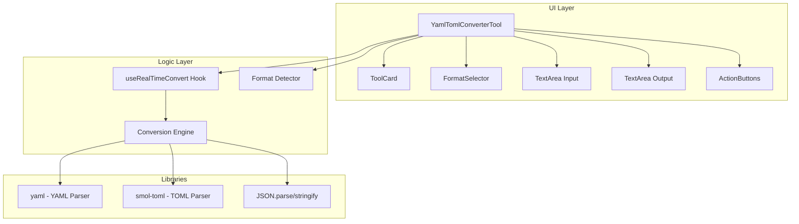

# 设计文档

## 概述

YAML/TOML 转换器是一个浏览器扩展工具，用于在 JSON、YAML 和 TOML 三种数据格式之间进行相互转换。该工具采用 React + TypeScript 实现，遵循 Neo-Brutalism 设计风格，支持实时转换、格式自动检测和国际化。

## 架构



## 组件和接口

### 1. YamlTomlConverterTool 组件

主工具组件，负责整体布局和状态管理。

```typescript
interface YamlTomlConverterToolProps extends ToolComponentProps {
  isExpanded: boolean;
  onToggleExpand: () => void;
}

type DataFormat = 'json' | 'yaml' | 'toml';

interface ConverterState {
  sourceFormat: DataFormat;
  targetFormat: DataFormat;
  indentSize: 2 | 4;
}
```

### 2. Conversion Engine (转换引擎)

核心转换逻辑模块，位于 `src/utils/formatConverter.ts`。

```typescript
// 转换结果接口
interface ConversionResult {
  success: boolean;
  output: string;
  error?: {
    message: string;
    line?: number;
    column?: number;
  };
}

// 转换选项
interface ConversionOptions {
  indentSize?: 2 | 4;
}

// 核心转换函数
function convert(
  input: string,
  sourceFormat: DataFormat,
  targetFormat: DataFormat,
  options?: ConversionOptions
): ConversionResult;

// 格式特定的解析函数
function parseJson(input: string): any;
function parseYaml(input: string): any;
function parseToml(input: string): any;

// 格式特定的序列化函数
function stringifyJson(data: any, indent: number): string;
function stringifyYaml(data: any, indent: number): string;
function stringifyToml(data: any): string;
```

### 3. Format Detector (格式检测器)

自动检测输入文本格式的模块。

```typescript
// 检测结果
interface DetectionResult {
  format: DataFormat | null;
  confidence: 'high' | 'medium' | 'low';
}

// 检测函数
function detectFormat(input: string): DetectionResult;
```

检测规则：
1. 以 `{` 或 `[` 开头（去除空白后）→ JSON (高置信度)
2. 包含 `---` 文档分隔符或 YAML 特征缩进 → YAML (中置信度)
3. 包含 `[section]` 或 `key = value` 模式 → TOML (中置信度)

## 数据模型

### 支持的数据类型映射

| JavaScript 类型 | JSON | YAML | TOML |
|----------------|------|------|------|
| string | ✓ | ✓ | ✓ |
| number | ✓ | ✓ | ✓ (整数/浮点) |
| boolean | ✓ | ✓ | ✓ |
| null | ✓ | ✓ | ✗ (转为空字符串) |
| array | ✓ | ✓ | ✓ |
| object | ✓ | ✓ | ✓ (表) |
| Date | ✗ (字符串) | ✓ | ✓ |

### TOML 特殊限制

- TOML 不支持 `null` 值，转换时将 `null` 转为空字符串或省略
- TOML 数组元素必须是同一类型
- TOML 不支持顶层数组，需要包装在对象中

## 正确性属性

*A property is a characteristic or behavior that should hold true across all valid executions of a system-essentially, a formal statement about what the system should do. Properties serve as the bridge between human-readable specifications and machine-verifiable correctness guarantees.*

基于验收标准分析，以下是可测试的正确性属性：

### Property 1: JSON-YAML 往返一致性
*For any* 有效的 JavaScript 对象（不含 undefined、函数等不可序列化类型），将其序列化为 JSON 后转换为 YAML，再转换回 JSON 并解析，应得到与原对象深度相等的结果。
**Validates: Requirements 1.1, 1.3**

### Property 2: JSON-TOML 往返一致性
*For any* 有效的 JavaScript 对象（符合 TOML 限制：无 null、数组元素同类型、非顶层数组），将其序列化为 JSON 后转换为 TOML，再转换回 JSON 并解析，应得到与原对象深度相等的结果。
**Validates: Requirements 1.2, 1.5**

### Property 3: YAML-TOML 往返一致性
*For any* 有效的 JavaScript 对象（符合 TOML 限制），将其序列化为 YAML 后转换为 TOML，再转换回 YAML 并解析，应得到与原对象深度相等的结果。
**Validates: Requirements 1.4, 1.6**

### Property 4: JSON 格式检测准确性
*For any* 以 `{` 或 `[` 开头的有效 JSON 字符串，格式检测器应返回 `json` 格式。
**Validates: Requirements 2.1**

### Property 5: YAML 格式检测准确性
*For any* 包含 YAML 特征（`---` 分隔符或缩进键值对）的有效 YAML 字符串，格式检测器应返回 `yaml` 格式。
**Validates: Requirements 2.2**

### Property 6: TOML 格式检测准确性
*For any* 包含 TOML 特征（`[section]` 或 `key = value`）的有效 TOML 字符串，格式检测器应返回 `toml` 格式。
**Validates: Requirements 2.3**

### Property 7: 无效输入错误处理
*For any* 无效的格式字符串，转换函数应返回包含错误信息的结果，且 success 为 false。
**Validates: Requirements 3.1, 3.2, 3.3**

### Property 8: 缩进选项生效
*For any* 有效的 JavaScript 对象和缩进设置（2 或 4），JSON/YAML 输出的缩进应与设置一致。
**Validates: Requirements 6.1, 6.2**

## 错误处理

### 解析错误
- 捕获各库抛出的解析异常
- 提取行号和列号信息（如果可用）
- 生成用户友好的错误消息

### 类型不兼容错误
- TOML 不支持 null：转换时警告并替换为空字符串
- TOML 混合类型数组：提示用户数据不兼容
- 顶层数组转 TOML：自动包装为 `{ items: [...] }`

### 错误消息格式
```typescript
interface ParseError {
  message: string;      // 用户友好的错误描述
  line?: number;        // 错误所在行（1-based）
  column?: number;      // 错误所在列（1-based）
  originalError?: Error; // 原始错误对象
}
```

## 测试策略

### 属性测试 (Property-Based Testing)

使用 `fast-check` 库进行属性测试，验证转换的正确性。

```typescript
import fc from 'fast-check';

// 生成 TOML 兼容的对象
const tomlCompatibleObject = fc.letrec(tie => ({
  leaf: fc.oneof(
    fc.string(),
    fc.integer(),
    fc.double({ noNaN: true, noDefaultInfinity: true }),
    fc.boolean()
  ),
  array: fc.array(tie('leaf'), { maxLength: 5 }),
  object: fc.dictionary(
    fc.string().filter(s => /^[a-zA-Z_][a-zA-Z0-9_]*$/.test(s)),
    fc.oneof(tie('leaf'), tie('array'), tie('object')),
    { maxKeys: 5 }
  )
})).object;
```

### 单元测试

- 测试各格式的解析函数
- 测试格式检测器的边界情况
- 测试错误处理逻辑

### 测试框架

- 使用 Vitest 作为测试运行器
- 使用 fast-check 进行属性测试
- 每个属性测试运行至少 100 次迭代

## 依赖库

### 新增依赖

```json
{
  "dependencies": {
    "yaml": "^2.3.4",
    "smol-toml": "^1.1.4"
  }
}
```

### 库选择理由

- **yaml**: 功能完整的 YAML 1.2 解析器，支持自定义 schema，高质量维护
- **smol-toml**: 轻量级 TOML 1.0 解析器，体积小，适合浏览器环境

## 文件结构

```
src/
├── pages/newtab/components/tools/
│   └── YamlTomlConverterTool.tsx    # 主组件
├── utils/
│   └── formatConverter.ts            # 转换引擎
├── types/
│   └── tools.ts                      # 添加新工具 ID
└── i18n/locales/
    ├── en.json                       # 英文翻译
    └── zh-CN.json                    # 中文翻译
```
