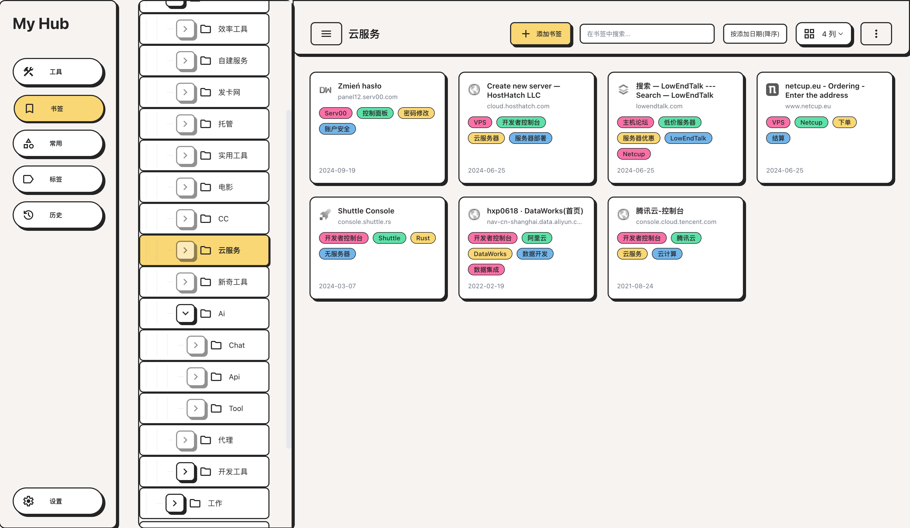
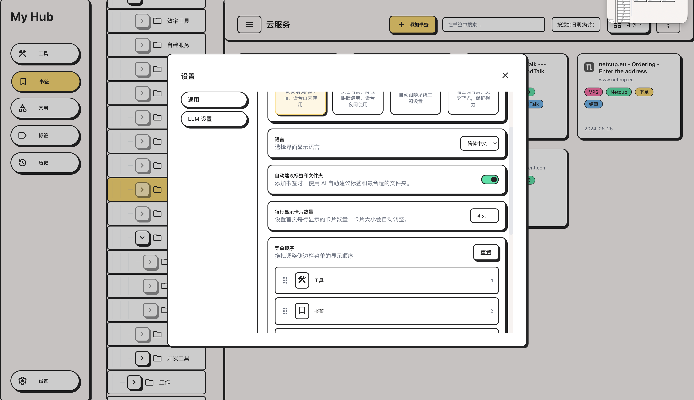

# My Hub

> 🚀 AI 增强的浏览器中枢：统一搜索、智能书签管理、开发者工具集

一款功能丰富的浏览器扩展，集成全局搜索、AI 标签生成、书签智能整理、开发者工具箱等功能，采用 Neo-Brutalism 设计风格，支持多主题与多语言。

## 📸 界面预览

| 首页 | 书签管理 | 工具箱 |
|:---:|:---:|:---:|
|  |  |  |

---

## ✨ 核心特性

### 🔍 全局搜索
- 单一输入框并行检索浏览历史、书签与标签
- 智能合并展示搜索结果

### 📚 书签增强
- **标签体系**：IndexedDB 持久化存储
- **批量操作**：加/移标签、移动、删除
- **智能排序**：按添加时间/最近使用/名称
- **去重 & 导出**：一键去重、HTML 格式导出

### 🤖 AI 能力
- **智能标签**：AI 自动生成书签标签
- **文件夹整理**：AI 生成文件夹结构预览并应用
- **批量处理**：重新生成/重试失败标签
- **本地优先**：Gemini Nano 优先，自动回退云端 LLM

### 🏷️ 标签中心
- 标签统计与可视化
- 重命名/删除/合并标签
- 多选批量操作
- 查看关联书签

### 📜 历史视图
- 时间/关键词筛选
- 按日期范围删除
- 日期索引导航
- 无限滚动加载

### 🧰 开发者工具箱
| 类别 | 工具 |
|------|------|
| 格式处理 | JSON 格式化、HTML/Markdown 转换、Diff 查看 |
| 编码转换 | Base64、URL 编解码、HTML 实体 |
| 加密哈希 | 密码生成、UUID、哈希计算、文本加解密 |
| 开发辅助 | 正则测试、JWT 解码、Cron 构建、时间戳转换 |
| 媒体工具 | 二维码生成/扫描、图片转换、颜色转换、SVG 处理 |
| 推送通知 | Bark 推送 |

### ⚙️ 个性化设置
- **主题**：浅色/深色/护眼/跟随系统
- **语言**：简体中文、English
- **布局**：卡片列数、菜单顺序自定义
- **数据**：导入导出、跨设备同步

---

## 🛠️ 技术栈

| 类别 | 技术 |
|------|------|
| 构建工具 | Vite 6、@crxjs/vite-plugin |
| 前端框架 | React 19、TypeScript 5 |
| 样式方案 | Tailwind CSS 4 |
| 数据存储 | IndexedDB、localStorage |
| 浏览器 API | bookmarks、history、sessions、tabs、clipboardRead |

---

## 📁 项目结构

```
src/
├── pages/
│   ├── newtab/        # 新标签页（首页/历史/书签/标签/工具/设置）
│   ├── popup/         # 扩展弹窗
│   ├── options/       # 独立设置页
│   ├── background/    # Service Worker
│   ├── content/       # 内容脚本
│   ├── devtools/      # DevTools 面板
│   └── panel/         # 侧边栏面板
├── components/        # 通用组件
├── hooks/             # 自定义 Hooks
├── services/          # 业务服务
├── lib/               # 工具函数
├── db/                # IndexedDB 封装
├── contexts/          # React Context
└── i18n/              # 国际化资源
```

---

## 🚀 快速开始

### 安装依赖

```bash
npm install
```

### 开发模式

```bash
# Chrome 开发（热重载）
npm run dev

# Firefox 开发
npm run dev:firefox
```

### 生产构建

```bash
# Chrome
npm run build:chrome

# Firefox
npm run build:firefox
```

### 加载扩展

**Chrome:**
1. 打开 `chrome://extensions`
2. 开启「开发者模式」
3. 点击「加载已解压的扩展」
4. 选择 `dist_chrome/` 目录

**Firefox:**
1. 打开 `about:debugging#/runtime/this-firefox`
2. 点击「临时加载附加组件」
3. 选择 `dist_firefox/manifest.json`

---

## ⚙️ LLM 配置

1. 打开新标签页 → 设置 → LLM 设置
2. 选择服务商（内置 SiliconFlow、OpenRouter）或自定义
3. 填写 API Key 和模型名称
4. 可选：勾选「优先使用 Gemini Nano」启用本地 AI

---

## 💾 数据管理

### 存储方案
- **IndexedDB**：标签、工具配置、失败记录
- **localStorage**：UI 偏好、LLM 设置、菜单顺序

### 导入导出
- 入口：设置 → 数据管理
- 支持：书签树、标签、网页组合、UI 偏好、工具配置、LLM/Bark 设置

> ⚠️ 跨设备或重装扩展前，请先导出数据备份

---

## 🔐 权限说明

| 权限 | 用途 |
|------|------|
| `bookmarks` | 读取与管理书签 |
| `history` | 读取与管理浏览历史 |
| `sessions` | 访问会话信息 |
| `tabs` | 标签页操作 |
| `storage` | 存储用户配置 |
| `activeTab` | 当前页面交互 |
| `clipboardRead` | 剪贴板读取 |

---

## ❓ 常见问题

<details>
<summary><b>Gemini Nano 不可用？</b></summary>

- 确认 Chrome 版本支持 Prompt API
- 或关闭「优先使用 Gemini Nano」改用云端
- 尝试重新加载扩展
</details>

<details>
<summary><b>云端 API 调用失败？</b></summary>

- 检查 Base URL、模型名称与 API Key 是否正确
- 必要时关闭流式模式
</details>

<details>
<summary><b>标签数据丢失？</b></summary>

- 书签 URL 变化或文件夹删除后，等待后台同步
- 可在标签页使用「重试失败标签」功能
</details>

<details>
<summary><b>Firefox 兼容性问题？</b></summary>

- 本项目基于 MV3，Firefox 采用脚本后台
- 建议优先在 Chrome 验证后再到 Firefox 复测
</details>

---

## 📄 License

[MIT](LICENSE)
